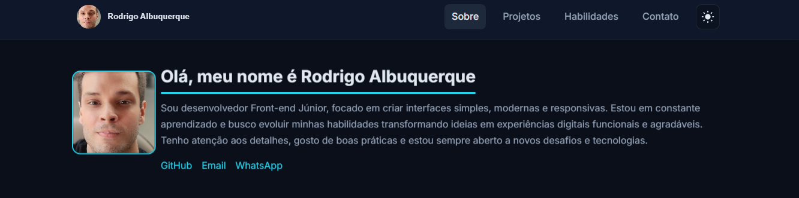

# Portfólio | Rodrigo Albuquerque — [Site](https://portifolio-tan-one-73.vercel.app/)

Portfólio moderno e responsivo em React + Vite, com rotas, tema claro/escuro, animações suaves e formulário de contato.

## 🖼️ Captura de Tela



## Visão Geral

- Rotas: `/` (Sobre), `/projetos`, `/habilidades`, `/contato`
- Tema: persistência no `localStorage` e animação sem flicker
- Contato: formulário via EmailJS com fallback automático para FormSubmit
- Acessibilidade: navegação por teclado, focos visíveis, roles adequados

## Projetos Apresentados

- Cinelista: aplicação para explorar filmes com busca, detalhes e lista personalizada.
  - Tecnologias: Next.js, React, TypeScript, CSS Modules, Axios, TMDb API, Vercel
  - Demo: https://nextjs-cinelista-xi.vercel.app/ | Repositório: https://github.com/rodrigoalbuq/nextjs-cinelista

- Diário de Bordo: PWA simples para registrar entradas de um diário, com suporte offline e sincronização.
  - Tecnologias: HTML5, CSS3, JavaScript, Service Worker API, Web Storage, Node.js, PWA, Vercel
  - Demo: https://diario-de-bordo-tawny.vercel.app/ | Repositório: https://github.com/rodrigoalbuq/Diario-de-Bordo

- Estilo Livre: site de barbearia com design responsivo e UI moderna.
  - Tecnologias: HTML5, CSS3, JavaScript, Bootstrap 5.3, Vercel
  - Demo: https://estilo-livre.vercel.app/ | Repositório: https://github.com/rodrigoalbuq/Estilo-Livre

## Requisitos

- Node.js 18+

## Instalação e Execução

```bash
npm install
npm run dev
```

Scripts úteis:

```bash
# testes
npm run test

# testes com UI
npm run test:ui

# build e preview
npm run build
npm run preview

# lint/format
npm run lint
npm run format
```

## Ambiente (.env)

Opcional para EmailJS (usa fallback se não definir):

- `VITE_EMAILJS_SERVICE_ID`
- `VITE_EMAILJS_TEMPLATE_ID`
- `VITE_EMAILJS_PUBLIC_KEY`
- `VITE_FALLBACK_RECIPIENT` (opcional; padrão: `rodrigoalvalbq@gmail.com`)

Crie um `.env` na raiz com as variáveis. Exemplo:

```env
VITE_EMAILJS_SERVICE_ID=seu_service_id
VITE_EMAILJS_TEMPLATE_ID=seu_template_id
VITE_EMAILJS_PUBLIC_KEY=sua_public_key
VITE_FALLBACK_RECIPIENT=seu_email@exemplo.com
```

## Estrutura

- `src/components`: Header, Footer, ProjectCard, Reveal
- `src/sections`: About, Projects, Skills, Contact
- `src/data`: dados dos projetos
- `src/services`: integrações (envio de emails)
- `src/styles`: estilos globais e tema
- `Screenshot/`: pasta pública (configurada em `publicDir` no Vite)

## Notas

- Para evitar “flash” de tema, o app inicializa com o valor do `localStorage` ou `prefers-color-scheme` antes da montagem.
- O conteúdo da About revela conforme o scroll usando `IntersectionObserver`.

## Qualidade de Código

- ESLint (flat config v9): configuração em [eslint.config.js](eslint.config.js)
- Prettier: configuração em [.prettierrc](.prettierrc)

## Aprendizados

Tecnologias que pratiquei durante o desenvolvimento deste projeto do meu portfólio:

- React Router: configuração de rotas e navegação SPA; uso de `Link` em componentes (ver [src/components/Footer.jsx](src/components/Footer.jsx)).
- Theming com Styled Components: alternância claro/escuro com persistência em `localStorage` e inicialização sem flicker (ver [src/styles/theme.jsx](src/styles/theme.jsx) e [src/styles/global.js](src/styles/global.js)).
- IntersectionObserver: scroll spy no `Header` e revelação progressiva de conteúdo com `Reveal` (ver [src/components/Reveal.jsx](src/components/Reveal.jsx) e [src/sections/About.jsx](src/sections/About.jsx)).
- Acessibilidade: uso de `role`, `aria-*`, foco visível e overlay com `role="presentation"` para o drawer mobile; testes garantem acessibilidade básica.
- Testes com Vitest + Testing Library: suíte cobrindo navegação, componentes e setup com polyfills (ver [vitest.setup.js](vitest.setup.js)).
- Envio de emails: integração com EmailJS via variáveis `.env` e fallback para FormSubmit (ver [src/services/email.js](src/services/email.js)).
- UX/Performance: Vite para desenvolvimento rápido, animações sutis e `lazy()` para carregar componentes sob demanda (ver uso em [src/sections/Contact.jsx](src/sections/Contact.jsx)).
- Conceitos: reforço de princípios como Responsive Design, Mobile First, APIs REST, AJAX e PWA (documentados em Habilidades).

## 🤝 Contribuições

Contribuições são bem-vindas! Agradeço desde já. Sinta-se à vontade para:

1. **Fork** o projeto
2. **Crie** uma feature branch
3. **Faça commit** das mudanças
4. **Abra** um Pull Request
